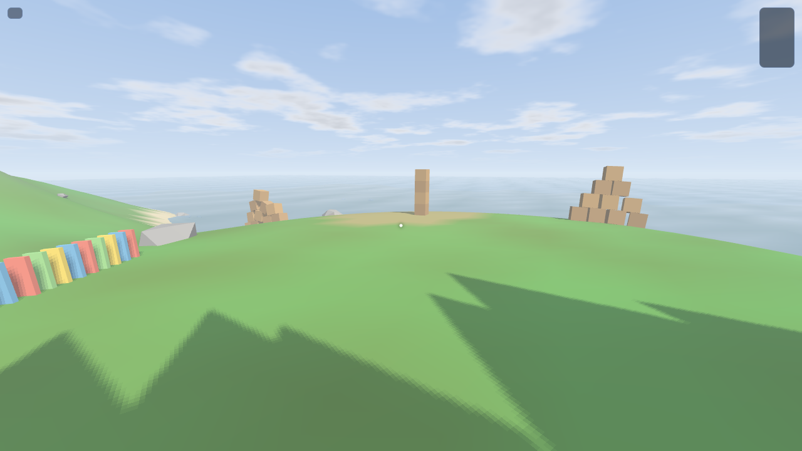
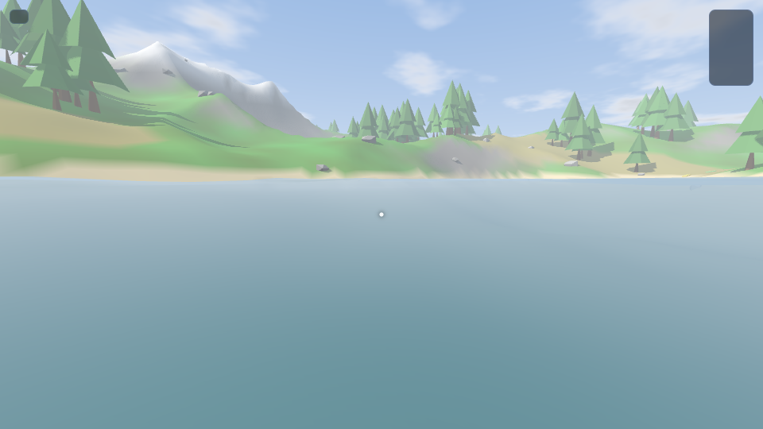
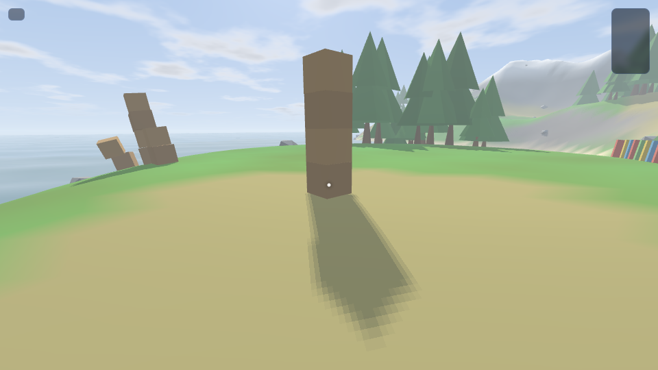

# VERTEX — a from-scratch WebGL game engine

A fully self-contained 3D physics sandbox that runs in the browser with **zero
libraries and zero assets**. Every system is hand-written: the WebGL2 renderer,
the rigid-body physics engine, the procedural terrain, and even the sound
effects (synthesized live with the Web Audio API).





## Run it

Any static file server works (ES modules require http://, not file://):

```bash
python3 -m http.server 8080
# then open http://localhost:8080
```

or `npx serve .`

## Controls

| Input | Action |
| --- | --- |
| WASD / Shift / Space | Move / sprint / jump |
| Mouse | Look (pointer lock) |
| Left click | Launch a cannonball |
| B | Spawn crate tower |
| N | Spawn crate pyramid |
| G | Spawn dominoes |
| V | Spawn wrecking ball (chain of distance joints) |
| R | Reset the scene |
| M | Mute |
| H | Toggle help |

## What's inside

### Renderer (`js/engine/`)
- WebGL2 forward renderer with **instanced rendering** for all bodies and
  vegetation (a frame is ~12 draw calls total)
- **Shadow mapping**: 2048² depth map, orthographic frustum that follows the
  camera with texel snapping, 3×3 PCF, slope-scaled + normal-offset bias
- **Procedural sky**: fullscreen triangle (no geometry, rays reconstructed from
  the inverse view-projection), gradient atmosphere, sun disc + glow, animated
  fBm clouds — all in a fragment shader
- **Animated water**: grid mesh displaced by summed sine waves with analytic
  normals, fresnel mixing with sky color, sun glint
- Exponential fog, hemispheric ambient, Blinn-Phong specular, gamma-correct
  pipeline, low-poly procedural meshes (cube, UV-sphere, pine tree, rock)

### Physics (`js/physics/`)
- Rigid bodies (spheres, OBBs) with quaternion orientation and full inertia
  tensors
- Broad phase: uniform-grid spatial hash; narrow phase: sphere/sphere,
  sphere-box, **SAT box-box with 4-point vertex-face manifolds**, and
  heightfield-terrain collision for both shape types
- Sequential-impulse solver with **warm starting**, two-tangent accumulated
  Coulomb friction, split-impulse positional correction, restitution,
  **4× substepping**, alternating solve order, and body sleeping
- **Distance joints** (the wrecking ball's chain), impact events routed to audio

### Terrain (`js/terrain/`)
- Seeded gradient noise (fBm hills + ridged mountains behind a mask), carved
  lake basins, flattened spawn plateau
- Biome vertex coloring (lakebed, beach, two-tone grass, rock by slope, snow)
- The same bilinear heightfield drives rendering, physics, and object scatter
  (trees/rocks placed by cluster noise with slope/height rules)

### Audio (`js/game/audio.js`)
- 100% synthesized: impact thumps + noise bursts (metal pings for bouncy
  materials), cannon blasts, footsteps, wind (looped filtered noise with an
  LFO), and randomized spatial bird chirps
- **3D spatialization** through a pool of HRTF `PannerNode`s; the listener
  follows the camera

## Tests

```bash
node test/physics.test.mjs   # headless physics suite (stacks, joints, events)
node test/browser.test.mjs   # full end-to-end render test in headless Chrome
```

The physics suite verifies: spheres settle on terrain, 4-high box stacks stay
up, sphere-sphere separation, chain-joint stability, and impact event delivery.
